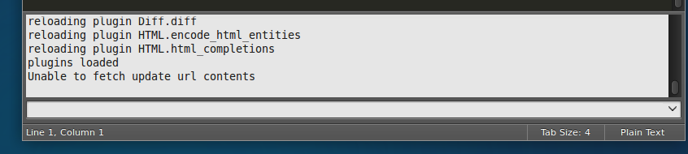
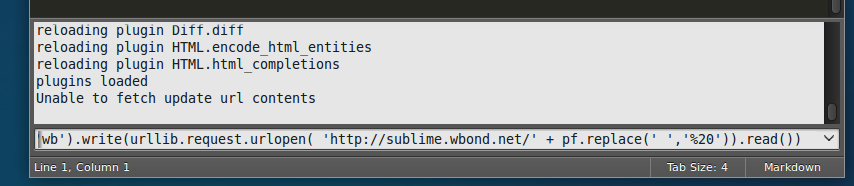
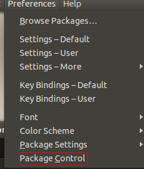
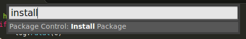
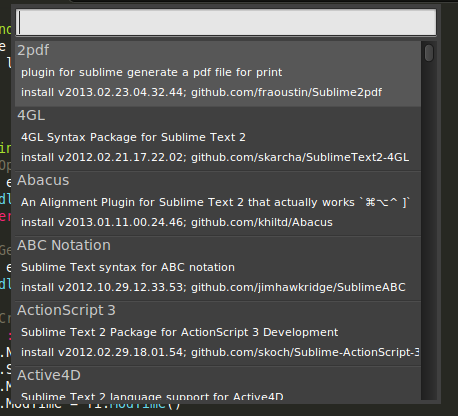

## Golang IDE for Sublime Setup Guide


### 1. Install sublime text 3

Download and install [sublime text 3]() depends on your OS type.
    
### 2. Install sublime plugin "package control"

Open sublime, press key **Ctrl + `**
    


Copy the below code:
    
```python
import urllib.request,os; pf = 'Package Control.sublime-package'; ipp = sublime.installed_packages_path(); urllib.request.install_opener( urllib.request.build_opener( urllib.request.ProxyHandler()) ); open(os.path.join(ipp, pf), 'wb').write(urllib.request.urlopen( 'http://sublime.wbond.net/' + pf.replace(' ','%20')).read())
```
Paste the code into console, then press **Enter**
		

    
Restart sublime, you will find **Package Control** under menu **Preferences**
    

	
### 3. Install sublime plugin **GoSublime** and **SidebarEnhancements**
	
Press **Ctrl + Shift + p**, a pop window like below, input "install" then press **Enter**
    

    	
Wait a moment, a package install dialog will pop
    	

    	
Input **"gosublime"** , select the item and press **Enter**
    
Use the same way install plugin **SidebarEnhancements**
    
### 4. Install gocode

Open terminal, input the below command:

```bash
go get github.com/nsf/gocode
go install github.com/nsf/gocode
```
After that, you can find the binary **"gocode"** under **$HOME/go_workspace/bin**

Move the **gocode** file to **/usr/local/go/bin**

```bash
sudo mv ~/go_workspace/bin/gocode /usr/local/bin
```